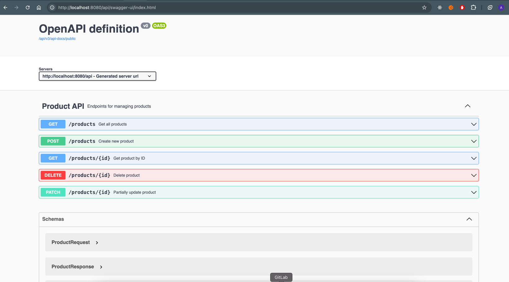

## 🚀 Getting started

### Clone the repository

```
git clone https://github.com/aelmrabti1/java-kata-back.git
```

### Build the project

```
cd product-api
gradle clean build
```

### Run

```
gradle bootRun
```

## ☕ Stack

| Technology  | URL                                                            |
|:-----------:|----------------------------------------------------------------|
|   Gradle    | -                                                              |
|   Java 21   | -                                                              |
| Spring Boot | -                                                              |
|   JUnit 5   | -                                                              |
|   Lombok    | -                                                              |
|  MapStruct  | -                                                              |
|     H2      | http://localhost:8080/api/h2-console  username : sa password : |
| Swagger UI  | http://localhost:8080/api/swagger-ui/index.html                |

## Test

Pour tester l’API, vous pouvez utiliser Swagger UI, une interface graphique qui permet d’explorer et d’interagir facilement avec les endpoints. Toutes les opérations CRUD ont été soigneusement documentées, y compris les requêtes, les réponses et les différents paramètres.

### Démarrez le serveur localement
```
gradle bootRun
```

### Accédez à l’interface Swagger UI en ouvrant l’URL suivante dans votre navigateur
```
http://localhost:8080/api/swagger-ui/index.html 
```



Vous pourrez voir une liste complète des endpoints disponibles, avec des détails sur chaque opération (GET, POST, PATCH, DELETE).

L’API est entièrement documentée pour vous permettre de naviguer facilement à travers les différentes fonctionnalités.